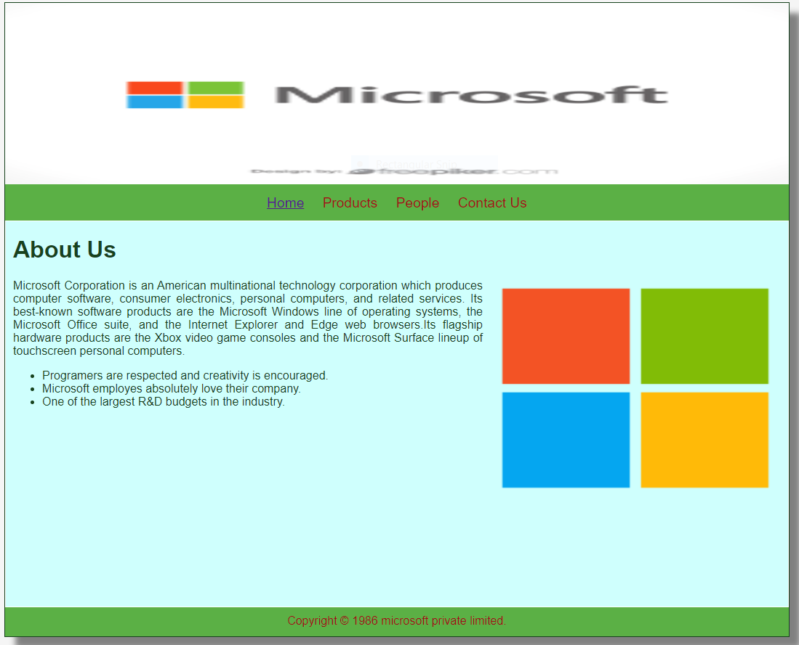
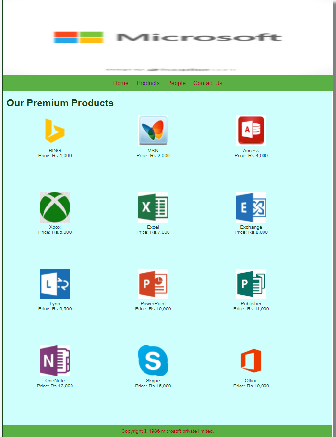
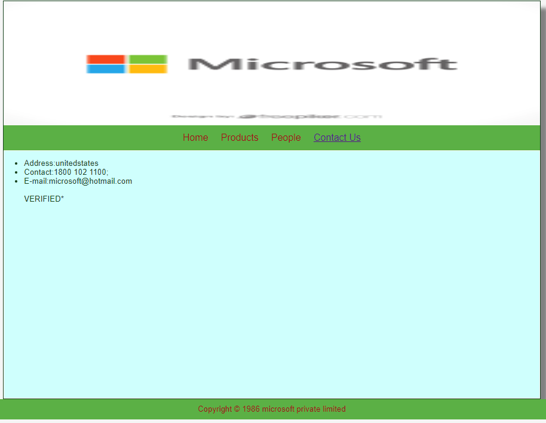

# Web Design for a Software Product Company

## AIM:

To design a static website for a software product company company.

## DESIGN STEPS:

### Step 1:

Requirement collection.

### Step 2:

Creating the layout using HTML and CSS.

### Step 3:

Updating the sample content.

### Step 4:

Choose the appropriate style and color scheme.

### Step 5:

Validate the layout in various browsers.

### Step 6:

Validate the HTML code.

### Step 6:

Publish the website in the given URL.

## PROGRAM :
## HOME PAGE:
~~~
<!DOCTYPE html>
<html lang="en">
  <head>
    <title>MICROSOFT Private Limited</title>
    <link rel="stylesheet" href="./css/layout.css" />
    <link rel="icon" href="./img/p13.jpg" type="image/x-icon" />
  </head>

  <body>
    

      

      

        
<a href="/static/home.html">Home</a>

        
<a href="/static/products.html">Products</a>

        
<a href="/static/people.html">People</a>

        
<a href="/static/contactus.html">Contact Us</a>

      

      

        

          <h1>About Us</h1>
          
          

            Microsoft Corporation is an American multinational technology corporation which produces computer software,
            consumer electronics, personal computers, and related services. Its best-known software products are the 
            Microsoft Windows line of operating systems, the Microsoft Office suite, and the Internet Explorer and
            Edge web browsers.Its flagship hardware products are the Xbox video game consoles and the Microsoft
            Surface lineup of touchscreen personal computers. 
            <ul>
              <li>Programers are respected and creativity is encouraged.</li>
              <li>Microsoft employes absolutely love their company.</li>
              <li>One of the largest R&D budgets in the industry.</li>
            </ul>
          

        

      

      

        Copyright &#169; 1986 microsoft private limited.
      

    

  </body>
</html>
~~~
## PRODUCT PAGE:
~~~
<!DOCTYPE html>
<html lang="en">
  <head>
    <title>MICROSOFT Private Limited</title>
    <link rel="stylesheet" href="./css/layout.css" />
    <link rel="icon" href="./img/icon.png" type="image/x-icon" />
  </head>

  <body>
    

      

      

        
<a href="/static/home.html">Home</a>

        
<a href="/static/products.html">Products</a>

        
<a href="/static/people.html">People</a>

        
<a href="/static/contactus.html">Contact Us</a>

      

      

        
    
          <h1>Our Premium Products</h1>
          

              
 
                  

                  
                  

                  
BING

                  
Price: Rs.1,000 

              

              
 
                  

                  
                  

                  
MSN

                  
Price: Rs.2,000

              

              
 
                

                
                

                
Access

                
Price: Rs.4,000

            

            
 
              

              
              

              
Xbox

              
Price: Rs.5,000

          

          
 
            

            
            

            
Excel

            
Price: Rs.7,000

        

        
 
          

          
          

          
Exchange

          
Price: Rs.8,000

      

      
 
        

        
        

        
Lync

        
Price: Rs.9,500

    

          
 
            

            
            

            
PowerPoint

            
Price: Rs.10,000

        

        
 
          

          
          

          
Publisher

          
Price: Rs.11,000

      

      
 
        

        
        

        
OneNote

        
Price: Rs.13,000

    

    
 
      

      
      

      
Skype

      
Price: Rs.15,000

  

  
 
    

    
    

    
Office

    
Price: Rs.19,000

          
        
      

      

        Copyright &#169; 1986 microsoft private limited.
      

    

  </body>
</html>
~~~
## PEOPLE PAGE:
~~~

<!DOCTYPE html>
<html lang="en">
  <head>
    <title>MICROSOFT Private Limited</title>
    <link rel="stylesheet" href="./css/layout.css" />
    <link rel="icon" href="./img/icon.png" type="image/x-icon" />
  </head>

  <body>
    

      

      

        
<a href="/static/home.html">Home</a>

        
<a href="/static/products.html">Products</a>

        
<a href="/static/people.html">People</a>

        
<a href="/static/contactus.html">Contact Us</a>

      

      

        
    
            <h1></h1>
            

                
 
                    

                    
                    

                    
BILL GATES

                    
FOUNDER 

                

                
 
                    

                    
                    

                    
JEFF

                    
CFO

                

                
 
                    

                    
                    

                    
SATYA NADELLA

                    
CEO

                

                
 
                    

                    
                    

                    
AMY

                    
MANAGER

                

                
 
                    

                    
                    

                    
BRAD

                    
HR

                

                
 
                    

                    
                    

                    
RAJIV

                    
ASSISTENT MANAGER

                

          

        

      

      

        Copyright &#169; 1986 microsoft private limited.
      

    

  </body>
</html>

~~~

## CONTACT US PAGE:
~~~
<!DOCTYPE html>
<html lang="en">
  <head>
    <title>MICROSOFT Private Limited</title>
    <link rel="stylesheet" href="./css/layout.css" />
    <link rel="icon" href="./img/icon.png" type="image/x-icon" />
  </head>

  <body>
    

      

      

        
<a href="/static/home.html">Home</a>

        
<a href="/static/products.html">Products</a>

        
<a href="/static/people.html">People</a>

        
<a href="/static/contactus.html">Contact Us</a>

      

      

          <ul>
              <li>Address:unitedstates  </li>
              <li>Contact:1800 102 1100; </li>
              <li>E-mail:microsoft@hotmail.com </li>
               VERIFIED*
          </ul>    
        

    

    

    

      

        Copyright &#169; 1986 microsoft private limited
      

    

  </body>
</html>
~~~
## OUTPUT:

### Home Page:

### Products Page:

### People Page:

### Contact Us Page:

## Result:

Thus a website is designed for the software product company and the HTML,CSS code are validated.
